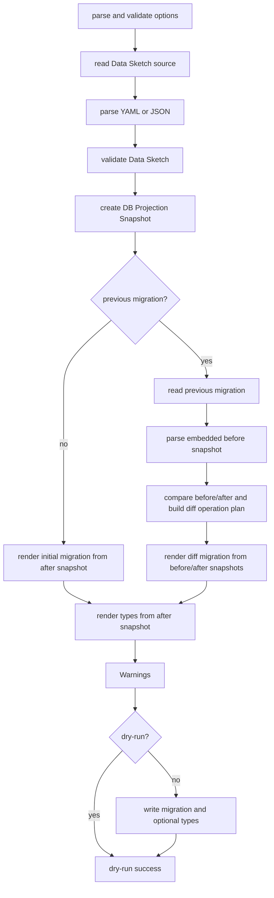
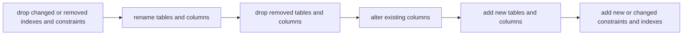
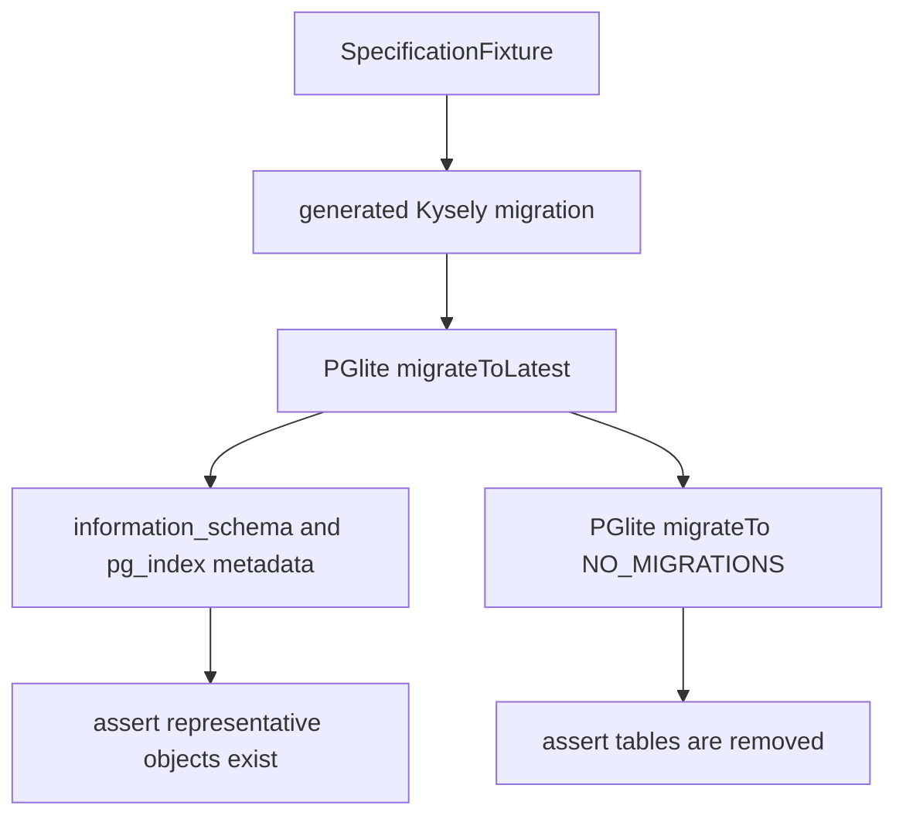

# `shot kysely-migration` Subcommand Implementation Notes

This document records implementation choices for the behavior specified in `shot-kysely-migration-command-spec.md`.

## Scope

This implementation completes initial migration generation and diff migration generation.

## Module Shape

kysely-migration command code lives in `src/commands/kysely-migration/`.

The package exposes the CLI entrypoint and a small library entrypoint. The
library entrypoint re-exports this command's `shot(...)` function as
`kyselyMigration`.

Within the source tree, `index.ts` exports the CLI `runSteps(...)` function and
`lib.ts` exports:

- `shot(...)`
- `ShotInput`
- `ShotOutput`

DB projection snapshot creation lives in `src/core/projector.ts`. It remains a
small concrete helper rather than a general projection abstraction.

## Processing Order

`runSteps(...)` performs work in this order:

1. Parse and validate command options.
2. Read the Data Sketch source.
3. Parse YAML or JSON.
4. Validate the Data Sketch, including any trace validation requested by the document.
5. Create the after `DB Projection Snapshot`, excluding stores marked with `tentative: true` unless `--include-tentative` is set.
6. When `--previous-migration` or `-p` is set, read the previous migration source and parse the before `DB Projection Snapshot`.
7. Collect warnings for excluded tentative stores and ignored enum check constraints.
8. If a before snapshot exists, compare the before and after snapshots and build the diff operation plan.
9. Render either the initial migration source from the after snapshot or the diff migration source from the before snapshot, after snapshot, and diff operation plan.
10. Render type source from the after snapshot.
11. In `--dry-run`, stop before writing files.
12. In normal mode, write the migration file and optional type file.

Rendering happens before writes so no partial output is written after a render error.

`--types-output` is rejected unless the path ends with `.d.ts`.

Migration rendering also rejects snapshot column types that Kysely's schema builder cannot accept as `ColumnDataType`. This is a migration output restriction only; snapshot projection and type definition rendering keep those Data Sketch types.

Diff migration rendering compares before and after snapshots and emits Kysely schema builder operations for table, column, constraint, and index additions, deletions, and changes. It detects table and column renames by Data Sketch map key-derived logical IDs and does not infer renames. Potentially destructive changes do not require an additional flag.

## Rendering

Generated migration files:

- include a line-commented YAML-style migration metadata block
- import `type { Kysely } from 'kysely'`
- declare local non-exported `interface MigrationDatabase`
- export `up(db: Kysely<MigrationDatabase>)`
- export `down(db: Kysely<MigrationDatabase>)`
- reject precision-only `numeric(<precision>)` before writing output
- embed the after snapshot in diff migration metadata
- render diff migration `up` from before to after and `down` from after to before
- use `renameTo` for table renames and `renameColumn` for column renames

Generated type files:

- include the same line-commented YAML-style migration metadata block
- export `interface Database`
- use the `.d.ts` extension
- are intended for application code via `new Kysely<Database>()`
- are rendered from the after snapshot in diff migration mode

Both interfaces use quoted table and column keys to avoid identifier sanitization rules.

The metadata block is delimited by `// ---` lines and is rendered with `data-sketch/embedded-db-projection-snapshot: 1.0.0-draft.0`, `generated_at`, and wrapped `payload`, in that order. The embedded snapshot format uses gzip+base64 as its fixed payload encoding. Migration source and type source rendering share the same DB projection snapshot and the same `generated_at` value for a command invocation.

Snapshot parsing scans the whole source for candidate line-commented YAML front matter blocks instead of assuming the metadata block starts at line 1 or that metadata keys appear in render order. This allows diff generation to read the snapshot when comments or other source text appear before or after the metadata block.

Snapshots must have `data-sketch/db-projection-snapshot: 1.0.0-draft.0`, table `id`, and column `id`. A snapshot read from `--previous-migration` or `-p` is rejected as diff input if its snapshot identifier is not supported or if table/column `id` values are missing. `data-sketch/embedded-db-projection-snapshot` and `generated_at` are metadata block fields and are not included in the snapshot JSON.

Diff rendering orders operations as follows: drop removed or changed indexes, foreign keys, unique constraints, and primary keys; rename tables and columns; drop removed tables and columns; alter existing columns; add tables and columns; add primary keys, unique constraints, and foreign keys; add indexes. `down` renders the same diff in the opposite direction.

## Warnings

Warnings use `logger.warn()` in command execution, are written to standard error, and do not change the exit code.

- stores marked with `tentative: true` excluded by default
- enum-derived check constraint intent ignored by migration rendering

`--include-tentative` includes stores marked with `tentative: true` and suppresses tentative exclusion warnings.

Enum-derived check constraint intent is warned and ignored for both initial and diff migrations. Diff rendering does not emit check constraint diffs in migration source.

## Dry Run

`--dry-run` performs read, parse, validation, snapshot projection, previous snapshot reading, warning collection, and render validation.

It writes no migration file and no type file, even when `--types-output` is provided. It does not validate output path writability.

## Dependency Strategy

The command uses Kysely types in generated output but does not import Kysely at runtime.

Tests add Kysely and PGlite as development dependencies so generated migrations can be executed with Kysely `Migrator`. Tests do not use `kysely-ctl`.

## Up/Down Execution Testing with PGlite

`DB Projection Snapshot` is a shot intermediate JSON model for DB-oriented projection, not a native PGlite schema object.

Generated migration execution tests apply the migration to PGlite with Kysely `Migrator`. These tests verify that `up` runs successfully and creates representative tables, columns, constraints, foreign keys, and indexes. They also verify that `down` runs successfully and removes tables.

These tests do not project PGlite metadata back into `DbProjectionSnapshot` shape. Detailed migration source behavior is covered by generated TypeScript fixture comparisons and focused render tests.

